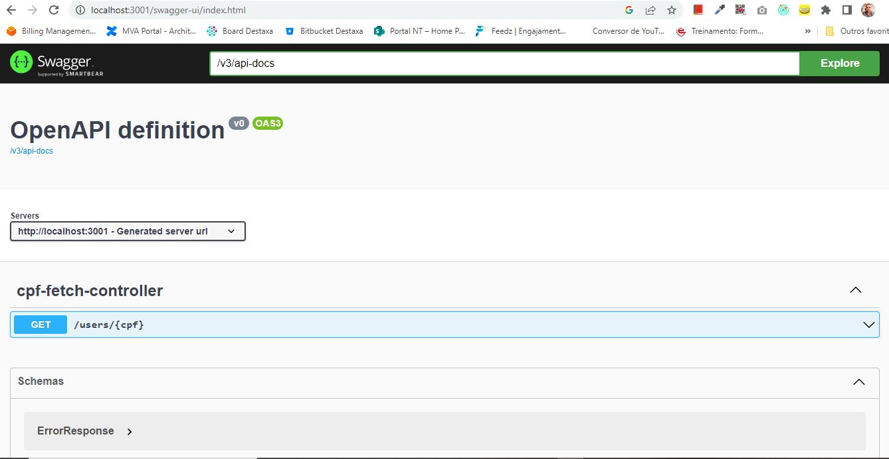

## About Me
[Carlos Maciel - Linkedin Profile](https://www.linkedin.com/in/carloshfmaciel/)

## About the project

This project was built to show knowledges about Java, Spring and REST apis as required at the [doc](docs/Desafio_Back.pdf).<br>
It is a dependency of the [agenda-service](https://github.com/carloshfmaciel/agenda-service) project and has the only purpose to validates if a cpf is or not is valid and randomly returns if a person is or not is able to vote.

## Starting project

```
mvn clean install
java -jar target/cpf-service-0.0.1-SNAPSHOT.jar
```
## Acessing Swagger UI

```
http://localhost:3001/swagger-ui/index.html
```


